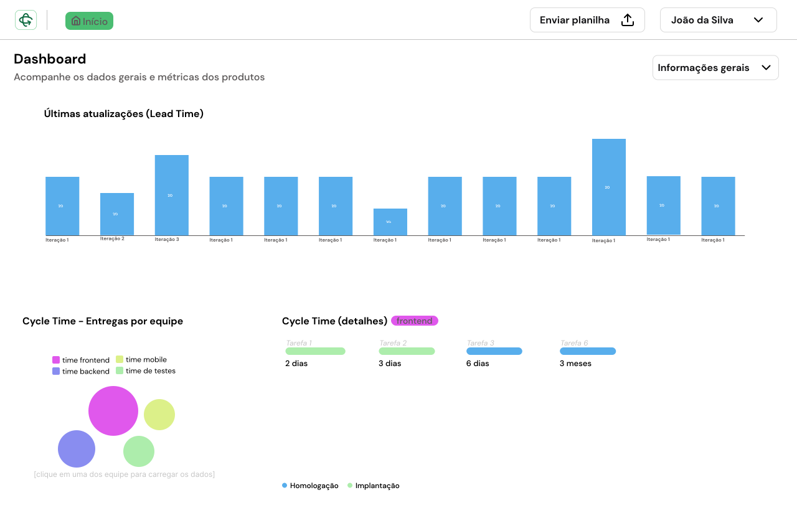

<p align="center">
  
</p>

## 💻 Projeto

sprint view é um app que coleta dados de diversas fontes, como planilhas e o Azure Boards, para exibir métricas através de gráficos.

<h1 align="center">
    
</h1>

## 💻 Tecnologias

Foram usadas as seguintes tecnologias no desenvolvimento do projeto:

- [React](https://reactjs.org)
- [Vite](https://vitejs.dev/)
- [TypeScript](https://www.typescriptlang.org/)
- [Tailwind](https://tailwindcss.com/)
- [shadc/ui](https://ui.shadcn.com/)
- [xlsx](https://www.npmjs.com/package/xlsx)
- [react-router-dom](https://reactrouter.com/en/main)

## 🚀 Como começar

Em uma máquina, com o node.js e git instalado, abra o terminal e rode o seguinte comando:

```bash 
$ git clone https://github.com/sprint-view/app.git
```

agora, acesse a pasta

```bash
$ cd app 
```

inicie o projeto com

```bash
# Instale as dependências usando:
$ npm i ou npm install

# Inicie o projeto com:
$ npm run dev
```

A aplicação vai estar disponível no endereço http://localhost:5173.

## 🔖 Layout

O layout foi desenvolvido no figma e pode ser visualizado pelo link abaixo:

- [Layout Web](https://www.figma.com/design/zqvad2NYvdqaJjsUujc8JR/sprint-view--Admin-Web-(Desafio-Banese)?node-id=186%3A80&t=JYRvN7wuJokDDV93-1)

Mas para acessar, precisa ter uma conta no [Figma](https://figma.com/).

### Desenvolvido por:
- [Marcos Paulo](https://github.com/maarcos4g)
- [Alexandre](https://github.com/justxandao)
- [Matheus Gabriel](https://github.com/matheussgb)
- [Gabriel](https://github.com/YoSoyCoka)